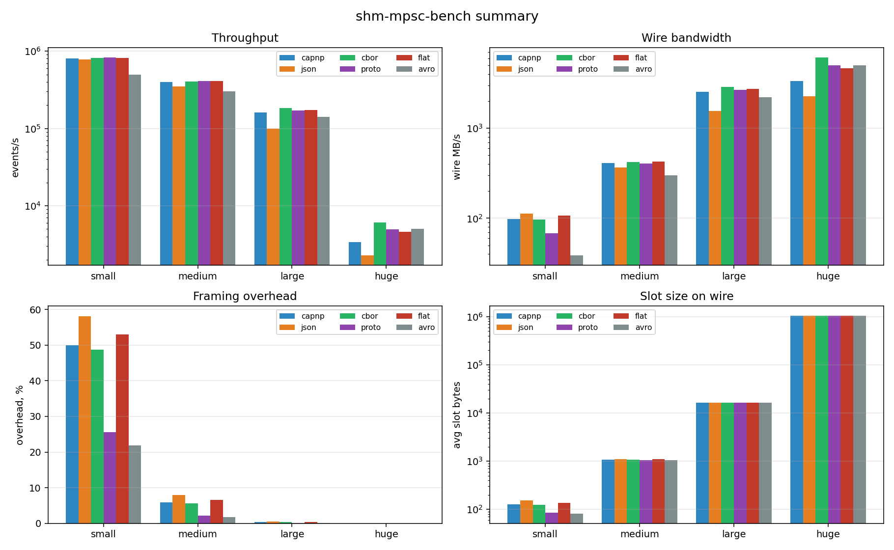
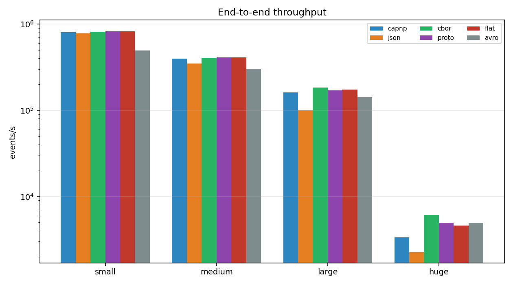
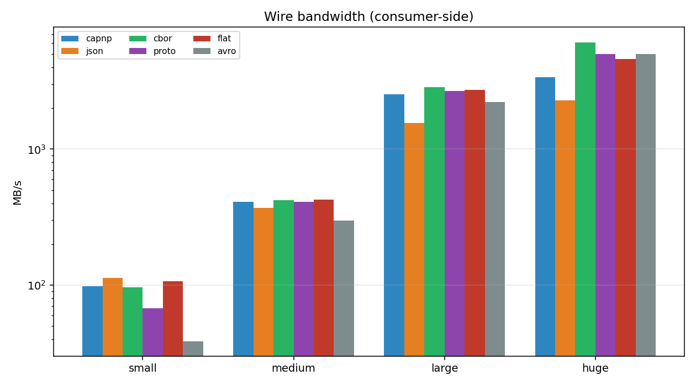
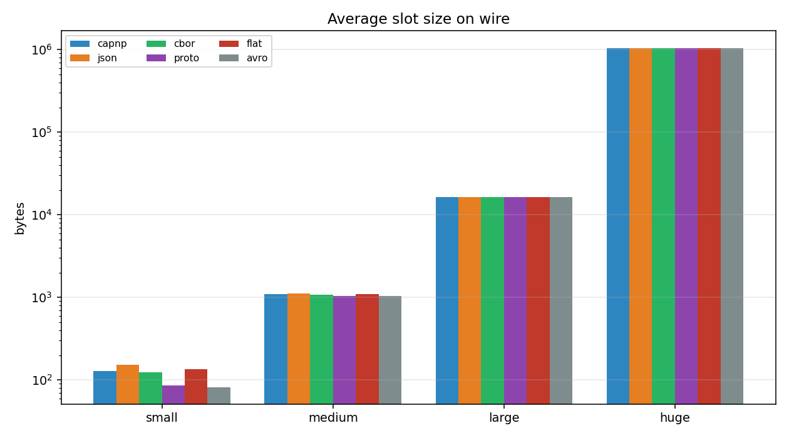
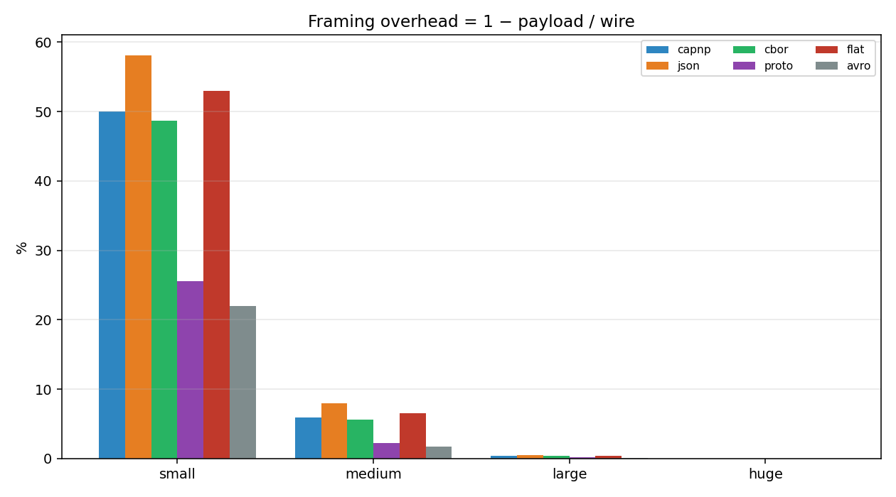

# shm-mpsc-bench

Сравнение шести кодеков на одной и той же data plane: Vyukov MPSC
кольцо в shared `memfd`, в которое пишут несколько продюсеров, а
один консьюмер вычитывает. Поверх кольца — *control plane*,
миниатюрный RPC по Unix-сокету, делающий ровно две вещи:

1. **`attach(name)`** — handshake сразу после того, как сервер
   передал продюсеру `memfd` через `SCM_RIGHTS`.
2. **`posted(seq)`** — fire-and-forget сигнал «проснись», который
   уходит **только** если продюсер выиграл CAS, переводящий
   состояние консьюмера из `PARKED` в `RUNNING`.

Bench сравнивает кодеки слота на одном и том же scaffold:

* **`capnp`** — Cap'n Proto, builder поверх `ScratchSpaceHeapAllocator`.
* **`json`** — UTF-8 JSON через `serde_json` с borrowed-десериализацией.
* **`cbor`** — CBOR (RFC 8949) через `ciborium` + `serde_bytes`.
* **`proto`** — Protobuf через `prost` (`protoc` встроен в build).
* **`flat`** — FlatBuffers через официальный `flatbuffers` (без
  codegen — низкоуровневый builder + ручное чтение vtable).
* **`avro`** — Apache Avro через `apache-avro` (schema-driven,
  динамический `Value`).

В коде остаются две реализации `Client`/`Server` (`capnp-rpc` и
`json-rpc`), но bench фиксирует control plane на JSON-RPC, чтобы
кодек был единственной переменной.

---

## Архитектура

```
       producer-A ─┐
       producer-B ─┤
       producer-C ─┼─ Unix socket (control plane: attach / posted)
       producer-D ─┘            │
              │                 │
              ▼ SCM_RIGHTS       ▼
        ┌──────────────┐   ┌─────────────┐
        │ shared memfd │   │ consumer    │
        │  ┌──────────┐│   │ thread      │
        │  │ MPSC ring├┼──►│ try_pop()   │
        │  └──────────┘│   │ codec.decode│
        └──────────────┘   └─────────────┘
```

Сервер создаёт `memfd`, mmap’ит, инициализирует кольцо и крутит
единственного консьюмера. На каждом `accept` отдаёт fd клиенту по
`SCM_RIGHTS` (вне фрейминга, до первого байта протокола) и
запускает control plane на том же сокете. Продюсер делает `fstat`
по полученному fd, чтобы знать, сколько байт mmap’ить, потом
делает `attach` и оттуда узнаёт `num_slots` / `slot_size`.

Пробуждение через один бит `consumer_state ∈ {RUNNING, PARKED}`.
`posted` стреляет только после удачного `CAS(PARKED → RUNNING)`.
Под нагрузкой сокет почти не нагружен.

---

## Структура

```
src/
├── lib.rs            — реэкспорт + SOCK_PATH + now_ns()
├── ring.rs           — Vyukov MPSC: push / try_pop / init  (runtime cfg)
├── shm.rs            — memfd + mmap + async SCM_RIGHTS
├── stats.rs          — атомарные счётчики + форматтер отчёта
├── server.rs         — generic accept-цикл + consumer-поток
├── producer.rs       — generic горячий цикл
├── proto/
│   ├── mod.rs        — трейты Codec, Client, Server + Kind, AttachInfo
│   ├── codec/{capnp,json,cbor,proto,flat,avro}.rs
│   └── control/{capnp_rpc,jsonrpc}.rs
└── bin/
    ├── server.rs     — CLI: --control, --codec, --size
    ├── producer.rs   — CLI: --control, --codec, --name, --count, --payload-size
    └── bench.rs      — гоняет все размеры × все кодеки и пишет JSON для plot.py
proto/event.proto     — protobuf-схема (компилируется build.rs через prost-build)
capnp/control.capnp   — capnp-схема (компилируется build.rs через capnpc)
scripts/run.sh        — build + bench + plot
scripts/plot.py       — рендер matplotlib
```

`Codec` теперь stateful: `Codec::new(cfg)` вызывается один раз на
продюсера / консьюмера; кодек владеет переиспользуемыми буферами
(capnp `ScratchSpaceHeapAllocator`, flatbuffers
`FlatBufferBuilder::reset`, prost — `String/Vec` clear+extend и т.д.).

`Client` / `Server` остаются stateless type-tag’ами; ничто не
мешает соединить любой кодек с любым control plane.

### Async SCM_RIGHTS

Tokio держит сокеты в non-blocking режиме, поэтому прямой вызов
`nix::sendmsg` / `recvmsg` по raw-fd возвращает `EAGAIN` задолго до
готовности peer’а. В `shm.rs` fd-passing обёрнут в
`UnixStream::async_io(Interest::WRITABLE | READABLE, …)`: на
`EAGAIN` мы возвращаем `io::ErrorKind::WouldBlock`, и Tokio
перепланирует нас.

---

## Запуск

```bash
cargo build --release

# По отдельности:
./target/release/server   --codec proto --size medium
./target/release/producer --codec proto --name p0 --count 200000 --payload-size 1024

# Полный бенч + графики:
./scripts/run.sh
# или:  PRODUCERS=8 SIZES="medium large" ./scripts/run.sh

# Только бенч (без графиков):
./target/release/bench --producers 4 --out out/bench.json
```

`scripts/run.sh` собирает release, гоняет bench, пишет
`out/bench.json` и рисует пять PNG'ов (`throughput.png`,
`bandwidth.png`, `overhead.png`, `slot_bytes.png`, `summary.png`).
Из внешних зависимостей нужен только Python с `matplotlib`.

Чтобы перегенерить числа и графики на своём железе: запускаешь
`./scripts/run.sh`, коммитишь `out/`. Таблицы ниже — содержимое
`out/bench.json`.

---

## Результаты

Хост: Intel Core i7-12700H (20 потоков), Linux 6.19, Rust nightly
(2026-03-25), `release`-профиль с `lto = "thin"`,
`codegen-units = 1`. Бенч в одном процессе, `current_thread`
runtime + `LocalSet`. По 4 продюсера на сценарий.

| размер | payload | слоты | байт/слот | events/producer |
|--------|---------|------:|----------:|----------------:|
| small  | 64 B    | 1024  |       512 | 500 000         |
| medium | 1 KiB   |  512  |     4 096 | 200 000         |
| large  | 16 KiB  |  256  |    32 768 | 50 000          |
| huge   | 1 MiB   |   32  | 2 097 152 | 1 500           |

В huge-тире payload — фиксированный синтетический base64-блоб
(1 MiB символов из base64-алфавита), аллоцируется один раз на
продюсера и переиспользуется.



### Пропускная способность (events/s)




| codec  |     small |    medium |     large |    huge |
|--------|----------:|----------:|----------:|--------:|
| capnp  |   807 206 |   396 624 |   161 516 |   3 362 |
| json   |   777 402 |   347 605 |    99 383 |   2 279 |
| cbor   |   811 311 |   406 848 |   182 611 |   6 102 |
| proto  |   826 583 |   408 731 |   170 475 |   4 974 |
| flat   |   821 513 |   408 693 |   173 402 |   4 612 |
| avro   |   495 543 |   301 552 |   142 097 |   4 990 |

### Пропускная способность по wire (MB/s, со стороны консьюмера)




| codec  |  small |   medium |    large |     huge |
|--------|-------:|---------:|---------:|---------:|
| capnp  |  98.54 |  411.54  | 2 533.54 | 3 361.97 |
| json   | 113.27 |  368.78  | 1 561.18 | 2 279.04 |
| cbor   |  96.51 |  421.11  | 2 863.75 | 6 102.78 |
| proto  |  67.77 |  408.08  | 2 667.51 | 4 974.45 |
| flat   | 106.55 |  427.18  | 2 721.31 | 4 612.00 |
| avro   |  38.74 |  299.65  | 2 222.82 | 4 990.31 |

### Средний размер слота (байт)




| codec  | small | medium |   large |     huge |
|--------|------:|-------:|--------:|---------:|
| capnp  |  128  | 1 088  | 16 448  | 1 048 640 |
| json   |  153  | 1 112  | 16 472  | 1 048 662 |
| cbor   |  125  | 1 085  | 16 444  | 1 048 638 |
| proto  |   86  | 1 047  | 16 408  | 1 048 599 |
| flat   |  136  | 1 096  | 16 456  | 1 048 648 |
| avro   |   82  | 1 042  | 16 403  | 1 048 595 |

### Framing overhead = 1 − payload / wire




| codec  |  small | medium |  large |  huge |
|--------|-------:|-------:|-------:|------:|
| capnp  | 50.0 % |  5.9 % |  0.4 % | 0.0 % |
| json   | 58.1 % |  8.0 % |  0.5 % | 0.0 % |
| cbor   | 48.7 % |  5.7 % |  0.4 % | 0.0 % |
| proto  | 25.6 % |  2.2 % |  0.1 % | 0.0 % |
| flat   | 52.9 % |  6.6 % |  0.4 % | 0.0 % |
| avro   | 21.9 % |  1.7 % |  0.1 % | 0.0 % |

Все пять плотов выше (`throughput.png`, `bandwidth.png`,
`slot_bytes.png`, `overhead.png`, `summary.png`) рисует
`scripts/plot.py` из `out/bench.json`.

### Как читать числа

* **Маленький payload — всё съедает framing.** На 64 B обвес
  доминирует. Avro и Protobuf — самые компактные на wire
  (82 / 86 B на слот, 22–26 % overhead) за счёт varint-тегов
  и нулевой запинды. JSON — самый большой (153 B, 58 %) —
  каждое имя поля прописано буквами. Cap'n Proto проигрывает
  по размеру (выравнивание на 8 байт), но кодек достаточно
  быстрый, чтобы держаться в лидерах по events/s.
* **Avro компактен, но медленный.** Schema-driven и
  dynamic-typed — encode каждый раз катается через
  `Value::Record(Vec<(String, Value)>)`, удваивая путь. Wire
  выигрывает, latency проигрывает.
* **Большой payload — гонка memcpy.** Когда payload >> framing,
  пропускная определяется тем, как быстро кодек переливает
  байты. CBOR с `serde_bytes`, Protobuf, FlatBuffers — все
  используют сырой length-prefix и идут на 4–6 GB/s через
  одну consumer-нить. JSON же обходит каждый байт ради
  кавычек / escape’ов и на encode, и на decode — упирается
  в ~2.3 GB/s.
* **`posted/1k events`** растёт от ~1 (steady state,
  консьюмер всегда RUNNING) до 15+ на huge, где один консьюмер
  не успевает за четырьмя продюсерами и чаще паркуется. Дизайн
  CAS-on-state не будит уже работающего консьюмера — стоимость
  всплывает только там, где она и должна.

### Гигиена аллокаций

Несколько неочевидных аллокаций были выловлены до измерений.
Кодек создаётся один раз на продюсера / консьюмера и владеет
переиспользуемыми буферами; на горячем пути ничто не должно
аллоцировать.

* `CapnpCodec` держит `Vec<u8>` scratch и собирает свежий
  `ScratchSpaceHeapAllocator` на каждом `encode` — одна
  аллокация на старте, не на событие.
* `JsonCodec` decode использует `EventIn<'a>` с
  `#[serde(borrow)] &'a str`; для нашего payload’а (без
  escape-последовательностей) serde-json берёт срез прямо
  из слота.
* Writer-задача `JsonClient` владеет своим буфером
  сериализации и переиспользует его через
  `serde_json::to_writer`.
* `ProtoCodec` переиспользует один и тот же `prost::Message`;
  `String::clear() + push_str` и `Vec::clear() + extend_from_slice`
  сохраняют capacity вместо повторных аллокаций.
* `FlatCodec` владеет `FlatBufferBuilder` и сбрасывает его
  между encode’ами — `reset()` откатывает offset в ноль, не
  трогая лежащий под ним буфер.
* `CborCodec` использует `serde_bytes::Bytes` / `ByteBuf`,
  чтобы ciborium кодировал/декодировал как CBOR major type 2
  (byte string) одним копированием. Стандартный
  serde-derive путь `Vec<u8>`-as-seq-of-u8 ломается на
  payload’ах больше ~1 KiB.
* `AvroCodec` — честное исключение: `apache-avro` всегда
  аллоцирует `Vec<(String, Value)>` на каждое событие, потому
  что таков его API. Это и отражено в числах `avro/*`.

---

## Что упрощено намеренно

* Один shm-сегмент на всех продюсеров. Для изоляции — сегмент
  на каждого: MPSC превращается в N × SPSC, это быстрее и
  проще рассуждать.
* Нет `F_ADD_SEALS`. В проде запечатать `SHRINK | GROW`,
  чтобы размер стал неизменяемым.
* Нет watchdog’а на зависший слот. Если продюсер падает между
  `fetch_add(tail)` и `store(seq)`, консьюмер встанет
  навсегда. Минимум — таймстамп резервирования и пропуск
  с логом по таймауту.
* `task::spawn_local` + `LocalSet`. capnp-rpc-типы !Send,
  поэтому весь рантайм однопоточный. Если нужен multi-thread
  — RPC живёт на одном треде, consumer-кольца на другом,
  общаются через `tokio::sync::mpsc`.
* В JSON поле `payload` — `&str`, а не `&[u8]`. Реальная
  бинарная нагрузка потребует base64 или отдельного
  shm-сегмента.

---

## Лицензия

MIT или Apache-2.0, на выбор.
